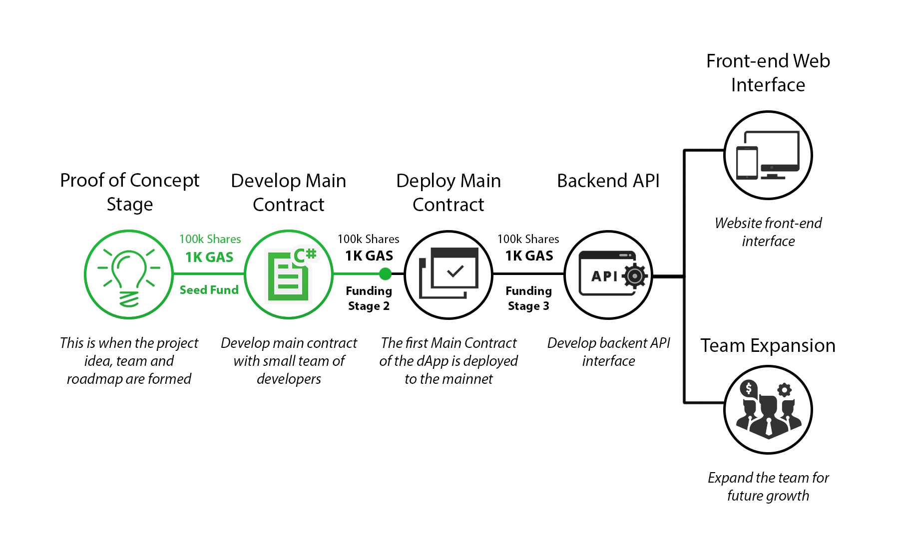

  

<h1 align="center">The Construct</h1>

  A complete dApp registry platform run on the <b>NEO</b> blockchain. This is the Construct. It's our loading program. We can load anything...

# Overview
The aim of **The Construct** is to provide a service to allow developers and users to contribute, collaborate, create, grow and manage dApps in a secure, transparent and feature rich environment. For ICO's to have widespread success regulation and transparency is inevitable and our plan is to create a soild foundation to make the process as simple and efficient as possible.

One problem with the current state of ICO's is that they require very little substance to produce large sum's of capital. Even if the the project is proven to be of high quality, once the ICO has ended the community has a very limited influence on the direction and pace of the project and still largly relies on trust. **The Construct** plans to counter this by implimenting **Funding Milestones** and **Smart Token Shares**. This model will incentivse projects to reach milestones faster and/or have more realistic goals and a generally higher standard of quality.

**The Construct** will use a **NEO** smart contract to store and verifiy sensitive information related to dApps and manage crowdfunds on the blockchain, to ensure its credibitly and security. **The Construct** API (javascipt/python) has been implemented as an abstract layer ontop of the **NEO** blockchain for convience, speed and realibilty. All of which can be verified externally via traditional contract invocation calls ( operations detailed below )

## Main Features:
- Impliments **Funding Milestones**, which ensures a dApp maintains its promisies, via incremental crowdfunding
- **Smart Token Shares** are distributed to investors/backers to incentivise contribution and early adopters.
- Categorises all registed dApps
- Feature rich API
- Enables dApp projects a platfrom rapidly gain community support and capital funds
- Developers have profiles, creating recognition within the commuinity
- Rating and review system for both developers and dApps
- Contracts can be linked to source code and allow for external verification and audit.
- Contract Audit Bounty (from verified Developer)
- Bug Bounty rewards set by developers (or contributed via crowd funding)
- Crowdfunded Bounty's for feature updates
- Crowdfunded Bounty for new project idea or competition (creator receives reward share)

## Contracts Depolyed:
- Construct Platform
- ShareToken Protocol
  - Crowd Funding ( Could be implimented within this contract ?? ) 

# Account types

### **User**:
As a user on the dAppIt platform you will be able to easily search different categorised projects, based on varying filters and ratings. Users will most importantly be able to propose a project or features within a project by creating a bounty fund, and rewarded with a share if completed.
### **Developer**:
As a developer on the dAppIt platform you can create/contribute and promote your projects. Every developer will have their own rating based directly on their contribution to a project and its rating.

### **Project**:
Each project will have a dedicated page containing important information about the categorised dApp, and more specifically the contracts associated with the project. Users and developers can review and rate the project. Contracts can be invoked directly from the platform, general stats about contract status will be displayed also.

# Platform Categories
### **dApp Library Explorer:**
  - Categorises all dApps
  - Filter dApps based on underlaying details
  - Displays basic info about dApp
  - Roadmap, and crowdfunded bountys can be set on milestones 

### **dApp Info:**
  - Displays all info about dApp
  - Description overview
  - Active Smart Contracts
  - Link to GitHub repo
  - Review and Rating system
  - Current funds in progress

### **Contract Info:**
  - Source Code verified to Script Hash ( compiler version needs to be specified )
  - Details about audit results
  - Bug Bounty fund

### **Developer Info:**
  - All dApps developer is connected to
  - Developer rating based on dApp contribution and peer-reviews

# Token Launch ??

## Token 

**STR**

## Token Summary
The goal of the token sale is to raise capital to cover any inital overheads including **NEO** deployment fees. To ensure the platform is stable, scalable and flexable a team of developers will be required to meet this demand. Most importantly this platform is built upon community engagement and passion which is why a huge 75% of the supply sold during the ICO.

Token holders will also recieve a dividend payout (in GAS) of combined system fees, which would automatically occur quarterly, regardless of token price.

Token holders will also have the right to a voting share, to guide the direction of the platform and have direct control over specific details such as fees. 

## Token Distribution

| Contribution | Allocation (%)     
| ------------- |:-------------:|
| Pre-Sale ICO  | 5
| Main ICO      | 65
| System Fees   | 5
| Development   | 10
| Admin         | 5
| Contingency   | 5

# Crowd Funding

Crowd funding plays an fundamental role within in the platform, as it will allow small projects with great ideas to gain capital and recognition rapidly. All projects submitted on the platfrom will have its own **Smart Token Shares**

# Smart Token Shares
Every registed project will automatically have its own **Smart Token Shares**, tracking investment share distribution, to later reward the early investors. Similar to how an ICO works, but will have the benifit of a faster funding turnaround due to a more intergrated granular milestone based approach.

**Smart Token Shares** can be traded OTC, but they arent the same as a traditional token so will require specific exchange support. Their main goal is to enable shares of the project to be distrubuted to the inital investors/backers fairly, which in turn will allow the "shareholders" potential influence in voting, or tokens in a pre-sale ICO if the project happens to do so. 

This is just a share distribution mechanism that the platform provides to enable projects to award their backers fairly. It will still require the project team and community to enforce this as flexibility and transparency are our main focus.

#### Project Token Name: 

Every project will have a unique token name, using a 1-10 charater extention to the platform STR token, eg: **STR-PROJECT**

#### Project Token Supply: 

Every project will always have the same supply of **1,000,000** tokens. 

# Funding Milestones

Every funding stage subsequently will liquidate all funds evenly as they are essentially a perentage share. However early investors generally will still maintain a higher share percentage, as each subsequent funding stage will have a reduced investor influence rate set. 

*All milestones have to predetermined before investor contribution, any unforseen milestones require a 51% consensus approval.*

### **Example Milestone Roadmap:**

  

### **Share Distribution Breakdown:**

| Funding Stage        | Influence (%)     |  Rasied (GAS)   | Investors  | Token Share| Calculation
| ------------- |:-------------:|:-------------:|:-------------:|:-------------:|:-------------:|
| Stage 1 | 100 | 1000 | 10 | 100,000 | 1,000,000 / 10 = 100,000
| Stage 2 | 50  | 1000 | 10 (20 total) | 25,000 | ( 1,000,000 / 20 ) / 50% = 25,000
| Stage 3  | 25  | 1000 | 10 (30 total) | 8,333 | ( 1,000,000 / 30 ) / 25% = 8,333
| And so on ...  | --  | -- | -- | -- | --

# ​​Contract Operations
## Definitions:

  - <i>**Private:** All private operations can only be invoked with an admin key ( aka server-side calls within the platform )</i>

  - <i>**Public:** All public operations can be invoked by anyone</i>

  - <i>**CrowdFund:** Funds are sourced from community</i>

  - <i>**Bounty CrowdFund:** Funds are sourced from community, and released for a specific definitive reason (can be locked in contract)</i>

  - <i>**Bounty Fund:** Funds are sourced from a project / developer, and released for a specific definitive reason (most likely bug bounty)</i>

## Invokeable Operations:
#### Creator:
  - **Hidden:**  
    - add_admin
    - remove_admin
    - set_fee

#### Admin:
  - **Private:**
    - remove_project
    - remove_developer
    - remove_user

#### Developer:
  - **Private:**
    - create_new_project
    - edit_project_details
    - add_contract_to_project
    - add_dev_to_project
    - create_bounty_fund
    - audit_contract

#### User:

  - **Public:**
    - get_platform_details
    - get_projects
    - get_project_details
    - get_contract_details
    - get_developers
    - get_developer_details
    - get_users
    - get_user_details

  - **Private:**
    - create_crowdfund
    - create_bounty_crowdfund
    - review_project

# Fee Structure
*Doesn't include NEO system fees.*

| Action        | Fee (GAS)     |
| ------------- |:-------------:|
| Register Project| 10 |
| Register Contract| 5 |
| Register Developer | 1 |
| Register User | 0 |
| Create Fund   |  10  |
| Create CrowdFund   |  5  |
| Complete Fund   |  1 %  |
| Complete CrowdFund   |  1 %  |
