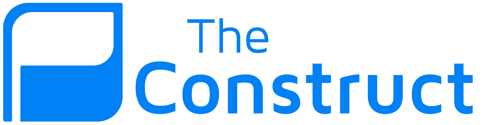
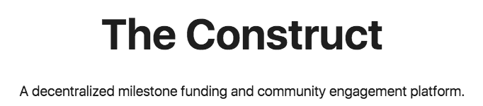
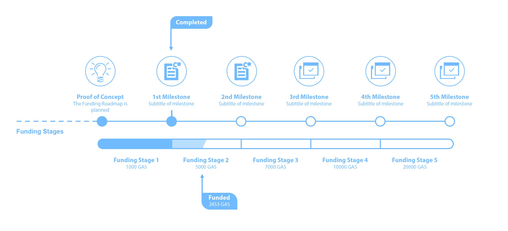
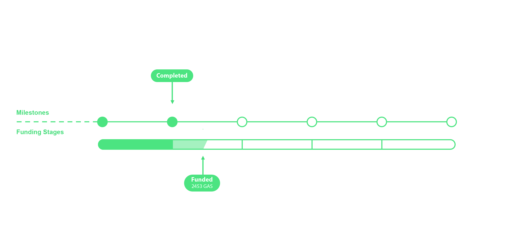
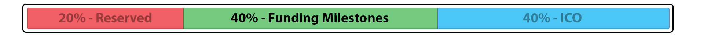
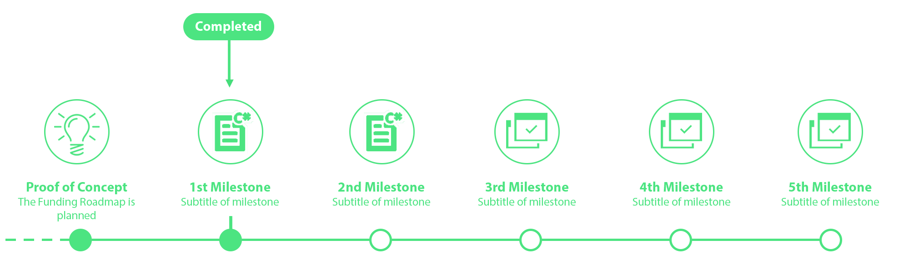
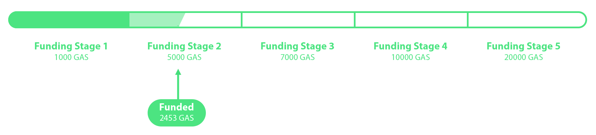
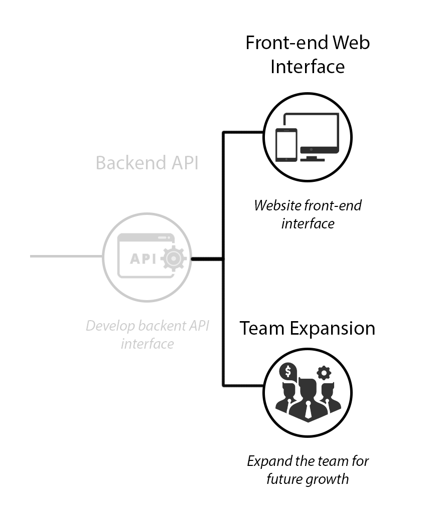
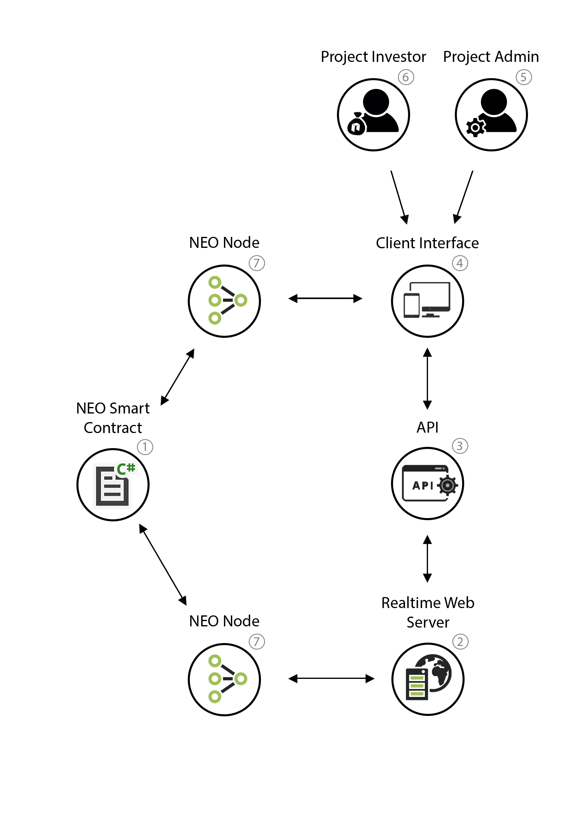

  

<!-- 

  

  -->

<!---

The Construct

A decentralized milestone funding and community engagement platform.

 
 
--->

# 1. Introducing The Construct
**The Construct** provides a platform for entrepreneurs and investors to collaborate, fund and grow projects in a secure and transparent environment backed by blockchain technology. The Construct holds project legitimacy and accountability right at the core of its function, ensuring the production of high quality and trusted projects.

<!-- 

** NOTES 

-	The Construct gives **legitimacy**, as potential investors can **transparently** follow the progress of the project.
-	**Breaks down** the process into **coherent milestones**, indicating continuous or incremental success (or not). 
-	**Alleviates FUD** on whether or not to invest, makes the decision easier based on current and previous progress. 

- So many options to choose from, this makes it easier and **high performing projects** will stand out
-	Introduces the concept of **accountability** in projects and ICOs. Not hitting the project milestones or targets = not getting the funding. Project admins must follow through on their **project promise**

-	Enables a process to expand on the initial resources, networks and capability by natural demand and interest. Project members might not have the experstise/time/funds nesseary to launch an ICO.

- Massive potential for projects in their early stages, allowing time for the project to mature organically without relying on recieving funding from an ICO too early. -->

 

## 1.1. What problem are we solving?

Initial Coin offerings (ICOs) have enabled vast sums of capital to be raised in a very short amount of time, (often in the range USD$10 million - USD$100 million)[1]. The problem with the current state of ICOs is that they require very little true substance to raise these funds. This lack of structure attracts scammers and inherently doesn't allow enough transparency to its investors. Even if the the project is proven to be of high quality, once the ICO has ended the community has a very limited influence on the direction and pace of the project and provides limited means of accountability. 

Even with a strong project or delivery at the core, often ICOs are launched in the early stages of development, generating hype and large sums of funding before an output is realised. Seldom do project creators have the combined skills, resources and strategy to realise the outputs of the promised projects. This can damage the project’s credibility long term, and leads to skepticism on the ICO market as it deters future investors. It is not guaranteed that the ICO project will follow through on the delivery of their concept or product therefore leading to an element of fear, uncertainty and doubt. 

In the current ICO space, a project generally only gets one opportunity to receive public funding via an ICO, forcing an all or nothing scenario for funding opportunities. There is a market for an alternate means of funding for both the project and investors. Projects need a way to incrementally receive funding based on demand and interest to allow for natural growth of the initial resources, team and capability. The Construct provides this solution.

 

## 1.2. Solution

**The Construct** implements a unique funding structure which relies on a planned project **Funding Roadmap**, specifying the exact process the project will take to reach the proposed output. A Funding Roadmap is broken down into a series of **Milestones** representing a significant task or goal which requires some sort of funding to complete, known as **Funding Stages**. A chain of alternating Milestones and Funding Stages will become the structure of the Funding Roadmap.

  

**The Construct's** unique funding structure is backed by NEO blockchain technology, The use of blockchain technology allows us to work in a global, secure, transparent and trustless environment. The Construct’s core has a decentralised ownership model, meaning it can never be deleted and will always remain self sustainable. Any funds or sensitive information stored on the blockchain will have predetermined access rights, so no other entity ( including us ) can obtain this without permission.

# 2. Index
<!-- TOC -->

- [1. Introducing The Construct](#1-introducing-the-construct)
  - [1.1. What problem are we solving?](#11-what-problem-are-we-solving)
  - [1.2. Solution](#12-solution)
- [2. Index](#2-index)
- [3. Investment Crowd Funding](#3-investment-crowd-funding)
  - [3.1. Funding Roadmap](#31-funding-roadmap)
    - [3.1.1. **Smart Token Shares**](#311-smart-token-shares)
    - [3.1.2. **Milestones**](#312-milestones)
    - [3.1.3. **Funding Stages**](#313-funding-stages)
    - [3.1.4. **Funding Roadmap Forking**](#314-funding-roadmap-forking)
- [4. KYC (Know Your Customer)](#4-kyc-know-your-customer)
- [5. Platfrom Structure](#5-platfrom-structure)
- [6. Account types](#6-account-types)
  - [6.1. Generic:](#61-generic)
  - [6.2. Investor:](#62-investor)
  - [6.3. Developer:](#63-developer)
  - [6.4. *Project Admin:*](#64-project-admin)
- [7. The Construct Requirements *TODO](#7-the-construct-requirements-todo)
- [8. Fee Structure](#8-fee-structure)
- [9. ​​Smart Contract Invoke Operations (Mockup)](#9-%E2%80%8B%E2%80%8Bsmart-contract-invoke-operations-mockup)
  - [9.1. Contracts Deployed:](#91-contracts-deployed)
  - [9.2. Contract Requirements](#92-contract-requirements)
- [10. References](#10-references)

<!-- /TOC -->

# 3. Investment Crowd Funding
Crowd funding is a great way to receive necessary funding from a diverse source of investors. It encourages community engagement and long term interest in seeing the product follow through; mutually beneficial funding model for project creators and investors alike.

Crowdfunding underpins The Construct’s platform by segregating a traditional fund into multiple funds as the project successfully progresses through its stages. This is done in way promoting transparency and legitimacy, we call this model a **Funding Roadmap**

## 3.1. Funding Roadmap
At the project proposal stage, project creators will pre-determine milestones and fundings stages which make up the development of the product. This makes up the **Funding Roadmap**. The Funding Roadmap is publicly accessible to potential investors and the general public, aiming for transparency along the process. Crowdfunding underpins the Funding Roadmap, as funds are traded for a predetermined financial stake in the project, we call this Smart Token Shares.

  

### 3.1.1. **Smart Token Shares**
Every project submitted automatically has its own Smart Token Shares (STS). The project creators determine the means of distribution for their Smart Token Shares, there are no prescriptive guidelines for how these are distributed. However, the distribution structure is publically accessible information so investors can make an informed decision.

Once the project Milestones have all been successfully completed, the shares can be directly transferred to a proposed Public Token before an ICO is launched via a process we call Token Share Transfer. Alternatively, projects don’t have to result in an ICO, but The Construct is designed for this purpose.

For example, within a project, the founders have chosen to reserve a 20% shareholding of their Smart Token Shares, 40% will be distributed to investors along the Funding Roadmap and the remaining 40% will distributed in the ICO at the end of the Funding Roadmap.

**Outdated image:*

  

**there is a default model for STS which project creators can manipulate to cater to the individual project.*

 

### 3.1.2. **Milestones**
A **Milestone** is a project goal or checkpoint that can be defined and tangibly proven as complete. The project creators determine the amount of Milestones and the activities undertaken at each point, while investors support or negate Milestone completion. In order to reach the next stage of funding, project creators give the investors from the preceding funding stage the opportunity to reject its completion. A Milestone is deemed as completed unless there is 51% rejection. In this case, the Milestone will need to be resubmitted or the Milestone Crowdfund is refunded back to its investors. This opt-in approach is designed to maintain efficient project momentum while still holding project creators accountable. 

  

<!-- **Outdated image:*

    

 -->

### 3.1.3. **Funding Stages**
A Funding Stage within a Funding Roadmap is a crowdfund with a defined fund goal, a funding timeframe and an account of how many Smart Token Shares will be distributed.

For each Funding Stage, when the funds goal is met or surpassed within the predetermined time-frame, the funding goal is a success. The predetermined Smart Token Shares will then be distributed according to investor contribution. If, however the funds goal is not met within the predetermined time-frame, the contributed investor funds will be refunded.

<!-- **Outdated image:*

  

 -->

  

### 3.1.4. **Funding Roadmap Forking**
A Roadmap path can be split into two different directions at any stage, this is called **Forking**. This allows unrelated Milestones to be completed in parallel. The new Roadmap Fork will have its own source of funding, and is not interdependent on one another's completion for funding. Once a fork is completed, it will continue along the Funding Roadmap.

<!-- **Outdated image:*

  

 -->

<!-- ### 3.1.5. Funding Roadmap Example:
**Outdated image:*

  

 -->

# 4. KYC (Know Your Customer)
With a potential for an ICO token sale, a KYC approval is required for all investors and project admins involved.

All information required for a KYC approval will be assessed and approved by The Construct, stored on secure private servers. Hashes of all the information, along with the account details (address etc) will be saved in the contract, allowing the information to be verified by both parties.

 
 

# 5. Platfrom Structure
We have designed **The Constructs** platform to be built upon the the NEO blockchain. Using NEO has been a conscious choice over other platforms for multiple reasons. 

First of all, NEO is fast and will only get faster as more nodes are added to the network. It has proven to maintain this speed under heavy system load (seen during ICO's). Neo uses a unique dBFT protocol (Delegated Byzantine Fault Tolerance) which only requires transactions one confirmation for 100% certainty, and uses substantially less power than a Proof-of-work protocol (used by Ethereum and Bitcoin). These advantages create a stable, fast, cheap and secure decentralized network for everyone.

Below is our platform configuration model we use to communicate between the NEO blockchain and the end-users:

    

# 6. Account types  
Accounts can be a combination of multiple types
## 6.1. Generic:
All accounts by default will be of the generic type. This is the base account which can do everything from invest, propose, create or contribute projects as a project-member, but will remain uncategorised. 

A generic account can be classed as a **Project Admin** for specific projects, either from creating or being assigned a project.

Every account will have its own address, which can either be imported (Private Key, Json) or generated automatically and saved locally

**The Construct will not store private keys, and will not be responsible for any loss*

## 6.2. Investor:
An Investor account is required to receive tokens distributed for an ICO. A registered investor needs to pass the KYC process.

## 6.3. Developer:
A Developer is based off a Generic account so can do everything they can do, however only developers can submit code to projects, audit contracts and peer review other developers. Every developer will also have their own rating. Developers will need to pass a registration process.

## 6.4. *Project Admin:*
Specific to a certain project, an assigned Project Admin is allowed to edit all mutable parameters of the project. Only the original Project Admin can add/remove other admins. A requirement for a Project Admin is that they pass the KYC process

 
 

# 7. The Construct Requirements *TODO

*Key: [ Number of days ]*
- [ ] **Whitepaper [ 2 ]**
  - [x] Summary
  - [x] Investment Crowd Funding
  - [x] KYC
  - [x] Account types
  - [ ] Smart Contract Invoke Operations
- [ ] **Smart Contract**
  - [ ] **Smart Token Shares [ 3 ]**
    - [ ] Associated Project
    - [ ] Supply
    - [ ] Ownership Balances
  - [ ] **Funding Roadmap [ 3 ]**
    - [ ] Milestone Indexes and Fork Index
    - [ ] Funding Stage Indexes and Fork Index
  - [ ] **Funding Stage [ 4 ]**
    - [ ] Goal
    - [ ] End Timestamp
    - [ ] Total Shares 
    - [ ] Balance
    - [ ] Desciption
  - [ ] **Milestone [ 3 ]**
    - [ ] Status
    - [ ] Progress
    - [ ] Desciption
  - [ ] **Project Registry [ 4 ]**
    - [ ] Projects
      - [ ] Name
      - [ ] Admins
      - [ ] Funding Roadmap
  - [ ] **User Registry [ 3 ]**
    - [ ] Users
      - [ ] Name
      - [ ] Invested Projects
      - [ ] Admin Projects
  - [ ] **KYC  [ 2 ]**
    - [ ] Associated User
    - [ ] Status
    - [ ] Hash of documents
- [ ] **Website**
  - [ ] **Client Side [ 14 ]**
    - [ ] Graphic User Interface
      - [ ] Local NEO Node and Wallet, connecting directly to NEO
        - [ ] Deposits
        - [ ] Withdrawls
        - [ ] Share Transfers
        - [ ] Data Verification
        - [ ] Wallets/Accounts are stored and opened locally
      - [ ] Connections to Realtime Server 
        - [ ] All Images
        - [ ] All Website files
  - [ ] **Server Side [ 14 ]**
    - [ ] Realtime Database of all public storage from Smart Contract
      - [ ] Projects
      - [ ] Users
      - [ ] Roadmaps
        - [ ] Milestones
        - [ ] Funding Stage
    - [ ] Realtime Storage of all files, public and private (with Hashes stored on smart contract)
      - [ ] Images
      - [ ] Large data files
    - [ ] Periodic data analysis and stats of all systems 

# 8. Fee Structure
*Doesn't include NEO system fees.*

| Action        | Fee (GAS)     |
| ------------- |:-------------:|
| Register Project| 10 |
| Register Contract| 5 |
| Register Developer | 1 |
| Register User | 0 |
| Create Fund   |  10  |
| Create CrowdFund   |  5  |
| Complete Fund   |  1 %  |
| Complete CrowdFund   |  1 %  |

# 9. ​​Smart Contract Invoke Operations (Mockup)
## 9.1. Contracts Deployed:
- Construct Platform

## 9.2. Contract Requirements
- Store and Create Projects
  - Unique Name
  - Milestone Hashes
  - Contract Hashes
  - Developer Hashes
  - Fund Hashes
- Store and Create Accounts
  - Address Hash
  - Type ( Generic, Developer )
  - Display Name
  - Project Hashes
  - Fund Hashes
- Verify and Audit Contacts
  - Store verification signatures
- Store and Create Milestones
  - Roadmap Hash
  - Milestone Hash
  - Project Hash
  - Stage Index
  - Fund Hash (Milestone Fund)
- Store, Create, Manage Distribute Funds
  - Fund Hash
  - Project Hash
  - Fund Limits
  - Fund Goal
  - Token Share Supply
  - Milestone Hash
  - Contributor Hashes
  - Contributor Contributions 
  - Distribute or Refund Funds
- Store and Distribute Smart Token Shares
  - Project Hash
  - Token Name
  - Registry of Shareholders (Address Hashes)
- KYC Store and Check Hashes
  - Info Hashes
  - KYC Status

# 10. References

[1] https://icowatchlist.com/statistics/year/2017, 2017