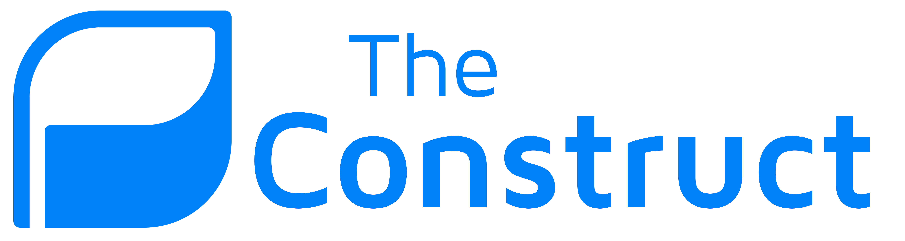

<br>
<br>
<p align="center" style="font-size:60px; line-height:10px">
  
</p>
<br>
<br>

## Pre-Release Version: 0.5.0

<!-- <p align="center">
  
</p>
</br> -->

<!---
<p align="center" style="font-size:60px; font-weight:bold; line-height:10px;">The Construct</p>

<p align="center" style="font-size:20px">A decentralized milestone funding and community engagement platform.</p>
<br>
<br>
--->

# Introducing The Construct
**The Construct** provides a platform for entrepreneurs and investors to collaborate, fund and grow projects in a secure and transparent environment backed by NEO blockchain technology. The Construct holds project legitimacy and accountability right at the core of its function, ensuring the production of high quality and trusted projects.


<!-- 

** NOTES 

-	The Construct gives **legitimacy**, as potential investors can **transparently** follow the progress of the project.
-	**Breaks down** the process into **coherent milestones**, indicating continuous or incremental success (or not). 
-	**Alleviates FUD** on whether or not to invest, makes the decision easier based on current and previous progress. 

- So many options to choose from, this makes it easier and **high performing projects** will stand out
-	Introduces the concept of **accountability** in projects and ICOs. Not hitting the project milestones or targets = not getting the funding. Project admins must follow through on their **project promise**

-	Enables a process to expand on the initial resources, networks and capability by natural demand and interest. Project members might not have the experstise/time/funds nesseary to launch an ICO.

- Massive potential for projects in their early stages, allowing time for the project to mature organically without relying on recieving funding from an ICO too early. -->


<br>

## What problem are we solving?

Initial Coin offerings (ICOs) have enabled vast sums of capital to be raised in a very short amount of time, (often in the range USD$10 million - USD$100 million)[1]. The problem with the current state of ICOs is that they require very little true substance to raise these funds. This lack of structure attracts scammers and inherently doesn't allow enough transparency to its investors. Even if the the project is proven to be of high quality, once the ICO has ended the community has a very limited influence on the direction and pace of the project and provides limited means of accountability. 

Even with a strong project or delivery at the core, often ICOs are launched in the early stages of development, generating hype and large sums of funding before an output is realised. Seldom do project creators have the combined skills, resources and strategy to realise the outputs of the promised projects. This can damage the project’s credibility long term, and leads to skepticism on the ICO market as it deters future investors. It is not guaranteed that the ICO project will follow through on the delivery of their concept or product therefore leading to an element of fear, uncertainty and doubt. 

In the current ICO space, a project generally only gets one opportunity to receive public funding via an ICO, forcing an all or nothing scenario for funding opportunities. There is a market for an alternate means of funding for both the project and investors. Projects need a way to incrementally receive funding based on demand and interest to allow for natural growth of the initial resources, team and capability. The Construct provides this solution.

<br>

## Solution

**The Construct** implements a unique funding structure which relies on a planned project **Funding Roadmap**, specifying the exact process the project will take to reach the proposed output. A Funding Roadmap is broken down into a series of **Milestones** representing a significant task or goal which requires some sort of funding to complete, known as **Funding Stages**. A chain of alternating Milestones and Funding Stages will become the structure of the Funding Roadmap.

<p align="center">
  
</p>

**The Construct's** unique funding structure is backed by NEO blockchain technology, The use of blockchain technology allows us to work in a global, secure, transparent and trustless environment. The Construct’s core has a decentralised ownership model, meaning it can never be deleted and will always remain self sustainable. Any funds or sensitive information stored on the blockchain will have predetermined access rights, so no other entity ( including us ) can obtain this without permission.


# Investment Crowd Funding
Crowd funding is a great way to receive necessary funding from a diverse source of investors. It encourages community engagement and long term interest in seeing the product follow through; mutually beneficial funding model for project creators and investors alike.

Crowdfunding underpins The Construct’s platform by segregating a traditional fund into multiple funds as the project successfully progresses through its stages. This is done in way promoting transparency and legitimacy, we call this model a **Funding Roadmap**


## Funding Roadmap
At the project proposal stage, project creators will pre-determine milestones and fundings stages which make up the development of the product. This makes up the **Funding Roadmap**. The Funding Roadmap is publicly accessible to potential investors and the general public, aiming for transparency along the process. Crowdfunding underpins the Funding Roadmap, as funds are traded for a predetermined financial stake in the project, we call this Project Sub Token.

<p align="center">
  
</p>


### **Project Sub Token**
Every project submitted automatically has its own Project Sub Token. The project creators determine the means of distribution for their Project Sub Token, there are no prescriptive guidelines for how these are distributed. However, the distribution structure is publically accessible information so investors can make an informed decision.

Once the project Milestones have all been successfully completed, the shares can be directly transferred to a proposed Public Token before an ICO is launched via a process we call Token Share Transfer. Alternatively, projects don’t have to result in an ICO, but The Construct is designed for this purpose.

For example, within a project, the founders have chosen to reserve a 25% shareholding of their Project Sub Token, 25% will be distributed to investors along the Funding Roadmap and the remaining 50% will distributed in the ICO at the end of the Funding Roadmap.

****Sub Token Share Example***
<p align="center">
  
</p>
<br>

### **Milestones**
A **Milestone** is a project goal or checkpoint that can be defined and tangibly proven as complete. The project creators determine the amount of Milestones and the activities undertaken at each point, while investors support or negate Milestone completion. In order to reach the next stage of funding, project creators give the investors from the preceding funding stage the opportunity to reject its completion. A Milestone is deemed as completed unless there is 51% rejection. In this case, the Milestone will need to be resubmitted or the Milestone Crowdfund is refunded back to its investors. This opt-in approach is designed to maintain efficient project momentum while still holding project creators accountable. 

<p align="center">
  
</p>

### **Funding Stages**
A Funding Stage within a Funding Roadmap is a crowdfund with a defined fund goal, a funding timeframe and an account of how many Project Sub Tokens will be distributed.

Any stage can also have an associated discount, whereby Project Sub Tokens will be sold at a cheaper rate to the investor. Typically earlier stages will have a higher discount to offset investor risk. 

For each Funding Stage, when the funds goal is met or surpassed within the predetermined time-frame, the funding goal is a success. The predetermined Project Sub Token will then be distributed according to investor contribution. If, however the funds goal is not met within the predetermined time-frame, the contributed investor funds will be refunded.

****Funding Stage Example:***
<p align="center">
  
</p>


****Funding Stage Discount Example:***
<p align="center">
  
</p>


### **Funding Roadmap Forking**
A Roadmap path can be split into two different directions at any stage, this is called **Forking**. This allows unrelated Milestones to be completed in parallel. The new Roadmap Fork will have its own source of funding, and is not interdependent on one another's completion for funding. Once a fork is completed, it will continue along the Funding Roadmap.

<!-- **Outdated image:*
<p align="center">
  
</p> -->

<!-- ### 3.1.5. Funding Roadmap Example:
**Outdated image:*
<p align="center">
  
</p> -->

# KYC (Know Your Customer)
With a potential for an ICO token sale, a KYC approval is required for all investors and project admins involved. 

<br>

# Platform Structure
*This is currently incomplete, only a CLI is in production, this is the future goal*

We have designed **The Constructs** platform to be built upon the the NEO blockchain. Using NEO has been a conscious choice over other platforms for multiple reasons. 

First of all, NEO is fast and will only get faster as more nodes are added to the network. It has proven to maintain this speed under heavy system load (seen during ICO's). Neo uses a unique dBFT protocol (Delegated Byzantine Fault Tolerance) which only requires transactions one confirmation for 100% certainty, and uses substantially less power than a Proof-of-work protocol (used by Ethereum and Bitcoin). These advantages create a stable, fast, cheap and secure decentralized network for everyone.

Below is our platform configuration model we use to communicate between the NEO blockchain and the end-users:
<p align="center">
    
</p>
<br>

# The Construct Token (CNS)

**The Construct** will deploy a NEP5 platform token onto the NEO network called **CNS**. The CNS token will be divisible up-to 8 decimals with a total supply of 10 Million tokens.

## System Funtionality
The CNS token will function as a distribution mechanism to proportionally award CNS holders **GAS (Neo Utility Coin)** dividends generated from system fees. Addresses holding CNS will be calculated periodically, and can be claimed directly on the platform.

The CNS token holders will also often have the opportunity to vote on major platform decisons, where an opt-in majority consensus mechanism will be put in place. This will be intergrated directly into the website platform.

The Construct intends to maintain heavily intergrated with its community, we believe this model will not only ensure its natural growth as a platform, but also ensure our investors maintain a real-world invested interest within the platform.

## Distribution Model
Commonly **Inital Coin Offerings (ICO)** will raise and distribute tokens over one or two stages (private-sale and public-sale), this makes sense when the project has something real to offer and already has a solid foundation. Unfotunately this isnt always the case. 

The **CNS** token will be minted and distrubuted in a very unique manner. Unlike the simple distribution phases mentioned above, the **CNS** token will incrementally be distributed over 5 stages. Early stages have an associated discount set from the standard sale price, this is to reward and incentivise very early investors.

****Discounts are displayed as % below***
<p align="center">
   
</p>

Each of the funding stages has a specifc milestone directly associated after it. This link defines the costs required to complete the task effectively. 

<p align="center">
   
</p> 

We believe this token distribution method will allow The Construct to grow and develop naturally without creating false promises, allowing investors to be involved during a very early stage, with a heavily discounted rate to offset the risk. 

After **Funding Stage 3** The Construct is aimed to be a functioning platform on the NEO testnet. Subsequently the common Private and Pubic Crowdsales will commence which will distribute the vast majority of the CNS tokens.

## CNS Distribution Breakdown
*Specific dates and prices will be announced before any funding begins.*

<p align="center">
   
</p> 


# Outstanding Tasks
  - Function to migrate the contract for future updates
  - Editable ```start_block``` and ```end_block``` till first block begins
  - Milestone reverse voting (votes to deem milestone uncomplete)
  - Automatically import contract to public key
  - Streamline refund process to automatically input ```-to_addr``` and ```-from_addr```

# The Construct CLI (Python)
*This is currently the main interface for the smart contract, convience functions have been built do deploy new projects, edit and inspect current ones. Along with the ability to contribute and claim contributions or refunds.*

## Installation:

The Construct CLI is dependant on neo-python libraries, it replaces the default neo-python prompt

1. clone neo-python

```
https://github.com/CityOfZion/neo-python.git
```

2. clone TheConstruct
```
https://github.com/nickazg/TheConstruct.git
```

3. 
```
cd neo-python/
```

4. open the usual venv for neo-python
```
python3.5 -m venv venv
source venv/bin/activate
```

5. Install neo-python dependencies
```
pip install -U setuptools pip wheel
pip install -e .
```

6. Now we can run The Construct CLI 
```
python ../TheConstruct/node/python_cli.py
```
## Useage
If in doubt run --help :) 
```
python ../TheConstruct/node/python_cli.py --help
```

## Examples:

  - All CLI calls require ```-w mywallet.db3 -pass password1234``` to authorize tx's
  - And will require ```-pro MyFirstProject``` unless ```-invoke``` and ```-args``` are used
  - ```--coznet``` flag is used, works the same as neo-python prompt
  

### Creating a new project, based on config file
```
python_cli.py --coznet -con TheConstruct/example_config.json -w mywallet.db3 -pass password1234 
```

### Summary of existing project
```
python_cli.py --coznet -sum -pro MyFirstProject -w mywallet.db3 -pass password1234
```

### Add address to KYC (as project owner only)
  - bytearray in quotes "" and esacape double quotes with \
```
python_cli.py --coznet -pro MyFirstProject -kreg "bytearray(b'#\xba\'\x03\xc52c\xe8\xd6\xe5\"\xdc2 39\xdc\xd8\xee\xe9')" -w mywallet.db3 -pass password1234
```

### Contribute to project 
```
python_cli.py --coznet -pro MyFirstProject -fs first_stage -send 10 -w mywallet.db3 -pass password1234
```

### Set Active Milestone Progress
```
python_cli.py --coznet -invoke update_active_ms_progress -args ['MyFirstProject', 100] -w mywallet.db3 -pass password1234
```

### Claim Contributions on sucessful fund as project owner
  - bytearray in quotes "" and esacape double quotes with \
  - You are required to import this contract with your public key manually beforehand (in neo-python), this will be the ```-from-addr```
  - This will claim the funds MINUS the fee
```
python_cli.py --coznet -cc -to_addr AK2nJJpJr6o664CWJKi1QRXjqeic2zRp8y -from-addr AFtntqjFSmyxDCp1TukxGRfqaAypBBc7DW -pro MyFirstProject -fs first_stage -w mywallet.db3 -pass password1234
```

### Claim refund on failed fund as contributor
  - bytearray in quotes "" and esacape double quotes with \
  - You are required to import this contract with your public key manually beforehand (in neo-python), this will be the ```-from-addr```
```
python_cli.py --coznet -cr -to_addr AK2nJJpJr6o664CWJKi1QRXjqeic2zRp8y -from-addr AFtntqjFSmyxDCp1TukxGRfqaAypBBc7DW -pro MyFirstProject -fs first_stage -w mywallet.db3 -pass password1234
```

### Invoke any other public operation
```
python_cli.py -invoke operation -args [arg1, arg2, .... ] -w mywallet.db3 -pass password1234
```


# ​​Smart Contract Operations
## Contract Hash:
- bc0e19a4fd0560d1b6d1f0825996a8b1d85d71f8

## Operations:
  *Check source code for more details*
  
  https://github.com/nickazg/TheConstruct/blob/master/construct/main/TheConstruct.py

### Funding Roadmap Operations
  - check_claim_owed
  - reset_claim_owed
  - add_project_admins
  - get_active_index
  - get_funding_stages
  - get_active_fs
  - get_milestones
  - get_active_ms
  - update_active_ms_progress

### Smart Token Share Operations
  - create_sts
  - sts_attribute
  - total_tokens_available

### Funding Stage Operations
  - create_fs
  - fs_attribute
  - fs_tokens_available
  - fs_status
  - fs_contribute
  - fs_addr_balance

### Milestone Operations
  - create_ms
  - ms_attribute
  - get_ms_progess
  - claim_fs_refund
  - claim_fs_contributions
  - claim_fs_system_fee

### KYC Operations
  - kyc_submit
  - kyc_register
  - kyc_status
  - get_kyc_submission


# References

[1] https://icowatchlist.com/statistics/year/2017, 2017