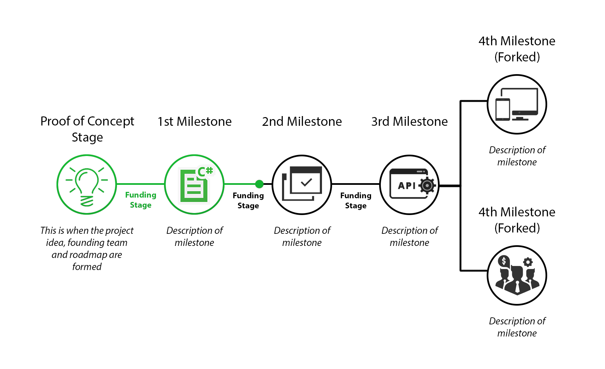

  

  

 

<!---

The Construct

A decentralized milestone funding and community engagement platform.

 
 
--->

# 1. Introducing The Construct
**The Construct** provides a platfrom for entrepreneurs and investors to collaborate, fund and grow projects in a secure and transparent environment backed by blockchain technology. The Construct holds project legitimacy and accountability right at the core of its function, ensuring the production of high quality and trusted projects are the standard. 

<!-- 
-	The Construct gives **legitimacy**, as potential investors can **transparently** follow the progress of the project.
-	**Breaks down** the process into **coherent milestones**, indicating continuous or incremental success (or not). 
-	**Alleviates FUD** on whether or not to invest, makes the decision easier based on current and previous progress. 

- So many options to choose from, this makes it easier and **high performing projects** will stand out
-	Introduces the concept of **accountability** in projects and ICOs. Not hitting the project milestones or targets = not getting the funding. Project admins must follow through on their **project promise**

-	Enables a process to expand on the initial resources, networks and capability by natural demand and interest. Project members might not have the experstise/time/funds nesseary to launch an ICO.

- Massive potential for projects in their early stages, allowing time for the project to mature organically without relying on recieving funding from an ICO too early. -->

 

## 1.1. What problem are we solving?

Initial Coin offerings (ICO's) have enabled vast sums of capital to be raised in a very short amount of time, (often in the range USD$10 million - USD$100 million). The problem with the current state of ICO's is that they require very little true substance to raise these funds. This lack of structure attracts scammers and inherently doesn't allow enough transparency to its investors. Even if the the project is proven to be of high quality, once the ICO has ended the community has a very limited influence on the direction and pace of the project and provides limited means of accountability. It is not guaranteed that the ICO project will follow through on the delivery of their concept or product therefore leading to an element of fear, uncertainty and doubt. **The Construct** aims to alleviate this issue.

Another looming issue is often good projects are being released too early to gain funding via ICO's, generating too much hype by promising too much and potentially harming the project's crediblity long term. A project will generally only get one opportunity to recieve public funding via an ICO, forcing an all-or-nothing scenario. Projects need a way to incrementally recieve funding based on demand and interest to allow for natrual growth of the initial resources, team and capability.

 

## 1.2. Solution

**The Construct** implements a unique funding structure which relies on a planned project **Funding Roadmap**, specifying the exact process the project will take to reach the proposed outcome.A **Funding Roadmap** will be broken down into a series of **Milestones** representing a significant task or goal which requires some sort of funding to complete, known as **Milestone Crowdfunds**. A chain of alternating Milestones and Milestone Crowdfunds will essentially become the structure of the **Funding Roadmap**.

  

**The Construct's** unique funding structure is backed by the latest NEO blockchain technology, The use of blockchain technology is essential as it will allow us to work in a global, secure, transparent and trustless environment. The Construct core has a decentralised ownership model, meaning it can never be deleted and will always remain self sustainable. Any funds or sensitive information stored on the blockchain will have predetermined access rights, so no other entity ( including us ) can obtain this without permission.

# 2. Index
<!-- TOC -->

- [1. Introducing The Construct](#1-introducing-the-construct)
    - [1.1. What problem are we solving?](#11-what-problem-are-we-solving)
    - [1.2. Solution](#12-solution)
- [2. Index](#2-index)
- [3. Investment Crowd Funding](#3-investment-crowd-funding)
    - [3.1. Funding Roadmap](#31-funding-roadmap)
        - [3.1.1. **Smart Token Shares**](#311-smart-token-shares)
        - [3.1.2. **Milestones**](#312-milestones)
        - [3.1.3. **Milestone Crowdfunds**](#313-milestone-crowdfunds)
        - [3.1.4. **Funding Roadmap Forking**](#314-funding-roadmap-forking)
        - [3.1.5. Funding Roadmap Example:](#315-funding-roadmap-example)
- [4. KYC (Know Your Customer)](#4-kyc-know-your-customer)
- [5. Platfrom Structure](#5-platfrom-structure)
- [6. Account types](#6-account-types)
    - [6.1. Generic:](#61-generic)
    - [6.2. Investor:](#62-investor)
    - [6.3. Developer:](#63-developer)
    - [6.4. *Project Admin:*](#64-project-admin)
- [7. The Construct Requirements *TODO](#7-the-construct-requirements-todo)
- [8. Fee Structure](#8-fee-structure)
- [9. ​​Smart Contract Invoke Operations (Mockup)](#9-%E2%80%8B%E2%80%8Bsmart-contract-invoke-operations-mockup)
    - [9.1. Contracts Depolyed:](#91-contracts-depolyed)
    - [9.2. Contract Requirements](#92-contract-requirements)

<!-- /TOC -->

# 3. Investment Crowd Funding
Crowd funding has proven to be a great way to not only recieve necessary funding but encourages a method of including the community as an essential part of a project, through investor interest.

Crowdfunding plays a fundamental role within in The Construct platform, and implements it in a unique format to benefit not only the project, but also the investors and the entire community by maintaining project transparency and legitimacy. We call this process a **Funding Roadmap**

## 3.1. Funding Roadmap
A proposed project will have a series of pre-determined milestones and fundings stages which make up the **Funding Roadmap**. This information is publicly accessible and this process aims for transparency.
To maintain investor interest, something of value needs to be tradedable . Within a Funding Roadmap this is done by trading funds for a predetermined share/stake in the project, we call this **Smart Token Shares**.

  

### 3.1.1. **Smart Token Shares**
Every project submitted automatically has its own Smart Token Shares. The project administrators determine the means of distribution for their Smart Token Shares, there are no prescriptive guidelines for how these are distributed. However, the distribution structure is publically accessible information, allowing for transparency and flexibility to include any number of different parties.

Once all the Milestones in the project have been successfully completed, the shares can be directly transferred to a proposed Public Token before an ICO is launched via a process we call Token Share Transfer. Alternatively, this doesn’t have to be an ICO, but The Construct is purposefully designed for this

For example, within a project, the founders have chosen to reserve a 20% shareholding of their Smart Token Shares, 40% will be distributed along the Funding Roadmap and the remaining 40% will distributed in the ICO at the end of the Funding Roadmap.

  

 

### 3.1.2. **Milestones**
A Milestone is a project goal or checkpoint that can be defined and tangibly proven as complete. The project administrator determines the amount of Milestones, and the activities undertaken at each point. A Milestone is deemed as completed unless there is rejection, the investors from the preceding Milestone Crowdfund have the opportunity to reject its completion. If there is a 51% rejection the Milestone will need to be resubmitted or the Milestone Crowdfund is refunded back to its investors. This opt-in approach is designed to maintain momentum while still holding accountability.

Within a Funding Roadmap there can be an unlimited number of Milestones, however every milestone will always require a preceding Milestone Crowdfund.

    

### 3.1.3. **Milestone Crowdfunds**
A Milestone Crowdfund within a Funding Roadmap is simply a crowdfund, with a defined fund goal, a timeframe for how long the funding should take and how many Smart Token Shares will be distributed. 

If the raised funds goal **is** met or surpassed within the predetermined timeframe this will declare the Milestone Crowdfund a success and all the predetermined Smart Token Shares will be distributed accordingly (based on investor contribution). 

If however the raised funds goal **is not** met within the predetermined timeframe, all funds that had been contributed by investors will be refunded (excluding any system fees)

  

  

### 3.1.4. **Funding Roadmap Forking**
A Roadmap path can be split into two different directions at any stage, this is called **Forking**. This allows unrelated Milestones to be completed in parallel. The new Roadmap Fork will have its own source of funding, and is not interdependent on one another's completion for funding. 

  

### 3.1.5. Funding Roadmap Example:

  

# 4. KYC (Know Your Customer)
With a potential for an ICO token sale, a KYC approval is required for all investors and project admins involved.

All information required for a KYC approval will be assessed and approved by The Construct, stored on secure private servers. Hashes of all the information, along with the account detials (address etc) will be saved in the contract, allowing the information to be verified by both parties.

 
 

# 5. Platfrom Structure

  

# 6. Account types  
Accounts can be a combination of multipule types
## 6.1. Generic:
All accounts by default will be of the generic type. This is the base account which can do everything from invest, propose, create or contribute projects as a project-member, but will remain uncategorised. 

A generic account can be classed as a **Project Admin** for specific projects, either from creating or being assigned a project.

Every account will have its own address, which can either be imported (Private Key, Json) or generated automatically and saved locally

**The Construct will not store private keys, and will not be responsible for any loss*

## 6.2. Investor:
An Invester account is required to recieve tokens distributed for an ICO. A registered investor needs to pass the KYC process.

## 6.3. Developer:
A Developer is based off a Generic account so can do everything they can do, however only developers can submit code to projects, audit contracts and peer review other developers. Every developer will also have their own rating. Developers will need to pass a registration process.

## 6.4. *Project Admin:*
Specific to a certain project, an assigned Project Admin is allowed to edit all muteable parameters of the project. Only the original Project Admin can add/remove other admins. A requirement for a Project Admin is that they pass the KYC process

 
 

# 7. The Construct Requirements *TODO

*Key: [ Number of days ]*
- [ ] **Whitepaper [ 2 ]**
  - [x] Summary
  - [x] Investment Crowd Funding
  - [x] KYC
  - [x] Account types
  - [ ] Smart Contract Invoke Operations
- [ ] **Smart Contract**
  - [ ] **Smart Token Shares [ 3 ]**
    - [ ] Associated Project
    - [ ] Supply
    - [ ] Ownership Balances
  - [ ] **Funding Roadmap [ 3 ]**
    - [ ] Milestone Indexes and Fork Index
    - [ ] Milestone Crowdfund Indexes and Fork Index
  - [ ] **Milestone Crowdfund [ 4 ]**
    - [ ] Goal
    - [ ] End Timestamp
    - [ ] Total Shares 
    - [ ] Balance
    - [ ] Desciption
  - [ ] **Milestone [ 3 ]**
    - [ ] Status
    - [ ] Progress
    - [ ] Desciption
  - [ ] **Project Registry [ 4 ]**
    - [ ] Projects
      - [ ] Name
      - [ ] Admins
      - [ ] Funding Roadmap
  - [ ] **User Registry [ 3 ]**
    - [ ] Users
      - [ ] Name
      - [ ] Invested Projects
      - [ ] Admin Projects
  - [ ] **KYC  [ 2 ]**
    - [ ] Associated User
    - [ ] Status
    - [ ] Hash of documents
- [ ] **Website**
  - [ ] **Client Side [ 14 ]**
    - [ ] Graphic User Interface
      - [ ] Local NEO Node and Wallet, connecting directly to NEO
        - [ ] Deposits
        - [ ] Withdrawls
        - [ ] Share Transfers
        - [ ] Data Verification
        - [ ] Wallets/Accounts are stored and opened locally
      - [ ] Connections to Realtime Server 
        - [ ] All Images
        - [ ] All Website files
  - [ ] **Server Side [ 14 ]**
    - [ ] Realtime Database of all public storage from Smart Contract
      - [ ] Projects
      - [ ] Users
      - [ ] Roadmaps
        - [ ] Milestones
        - [ ] Milestone Crowdfund
    - [ ] Realtime Storage of all files, public and private (with Hashes stored on smart contract)
      - [ ] Images
      - [ ] Large data files
    - [ ] Periodic data analysis and stats of all systems 

# 8. Fee Structure
*Doesn't include NEO system fees.*

| Action        | Fee (GAS)     |
| ------------- |:-------------:|
| Register Project| 10 |
| Register Contract| 5 |
| Register Developer | 1 |
| Register User | 0 |
| Create Fund   |  10  |
| Create CrowdFund   |  5  |
| Complete Fund   |  1 %  |
| Complete CrowdFund   |  1 %  |

# 9. ​​Smart Contract Invoke Operations (Mockup)
## 9.1. Contracts Depolyed:
- Construct Platform

## 9.2. Contract Requirements
- Store and Create Projects
  - Unique Name
  - Milestone Hashes
  - Contract Hashes
  - Developer Hashes
  - Fund Hashes
- Store and Create Accounts
  - Address Hash
  - Type ( Generic, Developer )
  - Display Name
  - Project Hashes
  - Fund Hashes
- Verify and Audit Contacts
  - Store verification signatures
- Store and Create Milestones
  - Roadmap Hash
  - Milestone Hash
  - Project Hash
  - Stage Index
  - Fund Hash (Milestone Fund)
- Store, Create, Manage Distribute Funds
  - Fund Hash
  - Project Hash
  - Fund Limits
  - Fund Goal
  - Token Share Supply
  - Milestone Hash
  - Contributor Hashes
  - Contributor Contributions 
  - Distribute or Refund Funds
- Store and Distribute Smart Token Shares
  - Project Hash
  - Token Name
  - Registry of Shareholders (Address Hashes)
- KYC Store and Check Hashes
  - Info Hashes
  - KYC Status
