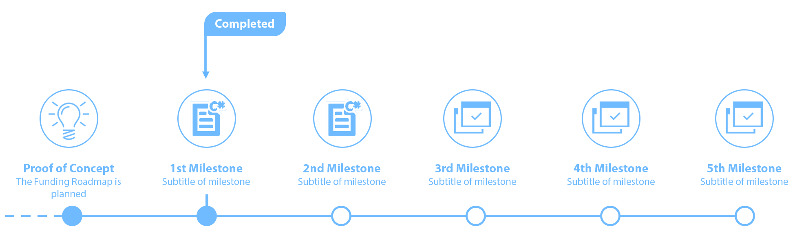

  

<h1 align="center">The Construct</h1>

A decentralized milestone funding and community engagement platform. For startups, existing projects and investors.
 
 

# 1. Introducing The Construct

**The Construct** provides a platform enabling anyone to contribute, collaborate, create and grow projects in a secure, transparent decentralized environment using blockchain technology. Ultimately, this enhances project growth and adoption in a global fair market, and attracts both entrepreneurs and investors unseen on any existing platforms.

 

## 1.1. Problem
While traditional crowdfunding platforms provide a great service for project-community engagement, the current issue is that they rely on donations or at best consumer pre-purchases. This provides little incentives for investors as they will not receive any ownership stake over the project resulting in a minimal return-on-investment (ROI). Ultimately this will limit the growth of the project, and engagement from the community. The centralized nature of the platform and reliance on a single currency also restricts projects to certain countries and creates unwanted fees.

However, Initial Coin offerings (ICO's) have enabled vast sums of capital to be raised in a very short amount of time, (often in the range USD$10 million - USD$100 million). The problem with the current state of ICO's is that they require very little true substance to raise these funds. This lack of structure attracts scammers and inherently doesn't allow enough transparency to its investors. Even if the the project is proven to be of high quality, once the ICO has ended the community has a very limited influence on the direction and pace of the project and it still largely relies on trust. It is not guaranteed that the ICO project will follow through on the delivery of their concept or product therefore leading to an element of skepticism. **The Construct** aims to alleviate this issue.

 

## 1.2. Solution
**The Construct** implements a unique funding structure, backed by blockchain technology.
The use of blockchain technology is essential, as it will allow us to work in a global, secure, transparent and trustless environment. While there will be system fees, **The Construct** core has a decentralised ownership model, meaning it can never be deleted and will always remain self sustainable. Any funds or sensitive information stored on the blockchain will have predetermined access rights, so no other entity ( including us ) can obtain this without permission.

**The Construct** unique funding structure relies on a planned project **Funding Roadmap**, specifying the exact process the project will take to reach the proposed outcome.
A **Funding Roadmap** will be broken down into a series of **Milestones** representing a significant task or goal which requires some sort of funding to complete, known as **Funding Stages**. A chain of alternating Milestones and Funding Stages will essentially become the structure of the **Funding Roadmap**.

Another exciting feature **The Construct** implements is something called **Brain Tree**, which ultimately tires to incentivise great ideas to become a reality, via a crowd funded competition. Anyone with just an idea can propose it to the global community, contributors show interest by investing into a fund and entrepreneurs/creators submit proof of work to potentially inherit the project+funds if chosen. While the original person who submitted the idea will get a portion of the winnings.

# 2. Index
<!-- TOC -->

- [1. Introducing The Construct](#1-introducing-the-construct)
    - [1.1. Problem](#11-problem)
    - [1.2. Solution](#12-solution)
- [2. Index](#2-index)
- [3. Investment Crowd Funding](#3-investment-crowd-funding)
    - [3.1. Funding Roadmap](#31-funding-roadmap)
        - [3.1.1. **Smart Token Shares**](#311-smart-token-shares)
        - [3.1.2. **Milestones**](#312-milestones)
            - [3.1.2.1. Milestones Visualized:](#3121-milestones-visualized)
        - [3.1.3. **Funding Stages**](#313-funding-stages)
            - [3.1.3.1. Funding Stages Visualized:](#3131-funding-stages-visualized)
        - [3.1.4. Funding Roadmap Example:](#314-funding-roadmap-example)
- [4. Brain Tree *TODO](#4-brain-tree-todo)
- [5. KYC (Know Your Customer)](#5-kyc-know-your-customer)
- [6. Account types](#6-account-types)
    - [6.1. Generic:](#61-generic)
    - [6.2. Investor:](#62-investor)
    - [6.3. Developer:](#63-developer)
    - [6.4. *Project Admin:*](#64-project-admin)

<!-- /TOC -->

# 3. Investment Crowd Funding
Crowdfunding has been proven to be a great way not only recieve necessary funding but also enables a method of including the community as an essential part of a project, creating a long term interest because people are now invested into the project.

Crowdfunding plays a fundamental role within in The Construct platform, and impliments it in a uniquie format to benifit not only the project, but also the investors and the entire community. We have called this process a **Funding Roadmap**

## 3.1. Funding Roadmap
A **Funding Roadmap** is an overview of all the milestones/goals and funding stages proposed by a project. To maintain investor interest something of value needs to be traded. Within a Funding Roadmap this is done by trading funds for a predetermined share/stake in the project we call this **Smart Token Shares**. 

### 3.1.1. **Smart Token Shares**
Every registered project will automatically have its own Smart Token Shares. Smart Token Shares will be distributed in whatever means necessary, which is decided by the project admins, and displayed publicly. 

Here is a possible example, where the founders have reserved a 20% shareholding, while 40% will be distributed along the Funding Roadmap and the remaining 40% will distributed in the ICO at the end of the Funding Roadmap.

  

This share distribution model allows the flexibility and transparency to include any number of different parties. 

Once all the **Milestones** in the project have been completed sucessfully the shares can then be directly transfered to a proposed Public Token before an ICO is launched via a process we call **Token Share Transfer**. 
 

### 3.1.2. **Milestones**
A Milestone within a Funding Roadmap is essentially a project goal or checkpoint that can be defined and proven once completed. For a Milestone to be deemed as completed all the investors from preceding Funding Stage has the opportunity to reject its completion, if there is a 51% rejecton the Milestone will need to be resubmitted or the Funding Stage is refunded back to its investors.

Within a Funding Roadmap there can be an unlimited number of Milestones, however every milestone will always require a preceding Funding Stage.

#### 3.1.2.1. Milestones Visualized:
A Milestone is represented as a circle with a title, icon, and description. Like so; *Uncompleted(Black) and Completed(Green)*

    

### 3.1.3. **Funding Stages**
A Funding Stage within a Funding Roadmap is simply a crowdfund, with a defined fund goal, a timeframe for how long the funding should take and how many Smart Token Shares will be distributed. 

If the raised funds goal **is** met or surpassed within the predetermined timeframe this will declare the Funding Stage a success and all the predetermined Smart Token Shares will be distributed accordingly (based on investor contribution). 

If however the raised funds goal **is not** met within the predetermined timeframe, all funds that had been contributed by investors will be refunded (excluding any system fees)

#### 3.1.3.1. Funding Stages Visualized:

Visualizing a single Funding Stage. Where green represents amount raised, and red represents amount remaining to reach the specified goal:

  

Or within the contex of a Funding Roadmap. Where we have the amount of shares associated with the fund (100k), The fund goal (1K GAS), and the name of the fund:

  

The Funding Roadmap will only allow the project to start another Funding Stage when all preceding Funding Stages and Milestones are completed sucessfully. 

### 3.1.4. Funding Roadmap Example:
A combination of both Milestones and Funding Stages

  

| Funding Stage        | Supply (Tokens)     |  Rasied (GAS)   
| ------------- |:-------------:|:-------------:
| **Seed Fund** | 100,000 | 1000 
| **Stage 2** | 100,000  | 1000 
| **Stage 3**  | 100,000  | 1000 
| **Stage 4** | 100,000  | 1000 
| *ICO*  | *400,000*  | -- 
| *Reserved*  | *200,000*  | -- 

# 4. Brain Tree *TODO
Brain Tree is designed to encourage people with only an idea to present them publicly to the community, recieveing a bonus if successfull.

  

Once an idea is proposed, an open-ended **14 day fund** will begin. The minimum requirement for a proposal is a rough whitepaper, and the first Proof-of-Work milestone requirements. 

Once the fund has completed, anyone can submit a Proof-of-Work of the milestone (incl a short "pick me!" message). After **7 days** submissions will close, and all the fund contributors can vote for the preferred Proof-of-Work submission. The Project and fund will then transfered to winning (51%) submission creator.

**If there are no submissions, the proposal will fail and all funds will be returned*

 
 

# 5. KYC (Know Your Customer)
With a potential for an ICO token sale, a KYC approval is required for all investors and project admins involved.

All information required for a KYC approval will be assessed and approved by The Construct, stored on secure private servers. Hashes of all the information, along with the account detials (address etc) will be saved in the contract, allowing the information to be verified by both parties.

 
 

# 6. Account types
Accounts can be a combination of multipule types
## 6.1. Generic:
All accounts by default will be of the generic type. This is the base account which can do everything from invest, propose, create or contribute projects as a project-member, but will remain uncategorised. 

A generic account can be classed as a **Project Admin** for specific projects, either from creating or being assigned a project.

Every account will have its own address, which can either be imported (Private Key, Json) or generated automatically and saved locally

**The Construct will not store private keys, and will not be responsible for any loss*

## 6.2. Investor:
An Invester account is required to recieve tokens distributed for an ICO. A registered investor needs to pass the KYC process.

## 6.3. Developer:
A Developer is based off a Generic account so can do everything they can do, however only developers can submit code to projects, audit contracts and peer review other developers. Every developer will also have their own rating. Developers will need to pass a registration process.

## 6.4. *Project Admin:*
Specific to a certain project, an assigned Project Admin is allowed to edit all muteable parameters of the project. Only the original Project Admin can add/remove other admins. A requirement for a Project Admin is that they pass the KYC process

 
 
